## Descrição do problema

Neste projeto serão analisados vinhos portugueses, brancos e tintos a partir de suas propriedades físico-químicas e sensoriais. O objetivo é utilizar Modelos Supervisionados para classificar estes vinhos como bons ou ruins.
É importante ressaltar que não temos informações sobre os tipos de uva, marca do vinho, preço de venda, etc. Além disso, também vale mencionar que há muito mais vinhos normais do que excelentes ou ruins. 

## Análise exploratória de dados 

#### Histogramas antes e depois do tratamento de dados

#### Antes

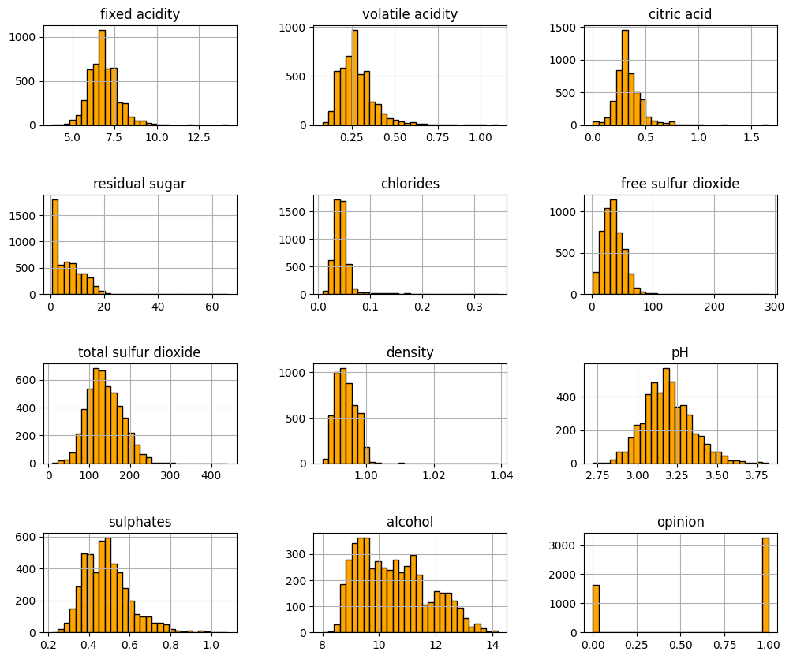

#### Depois

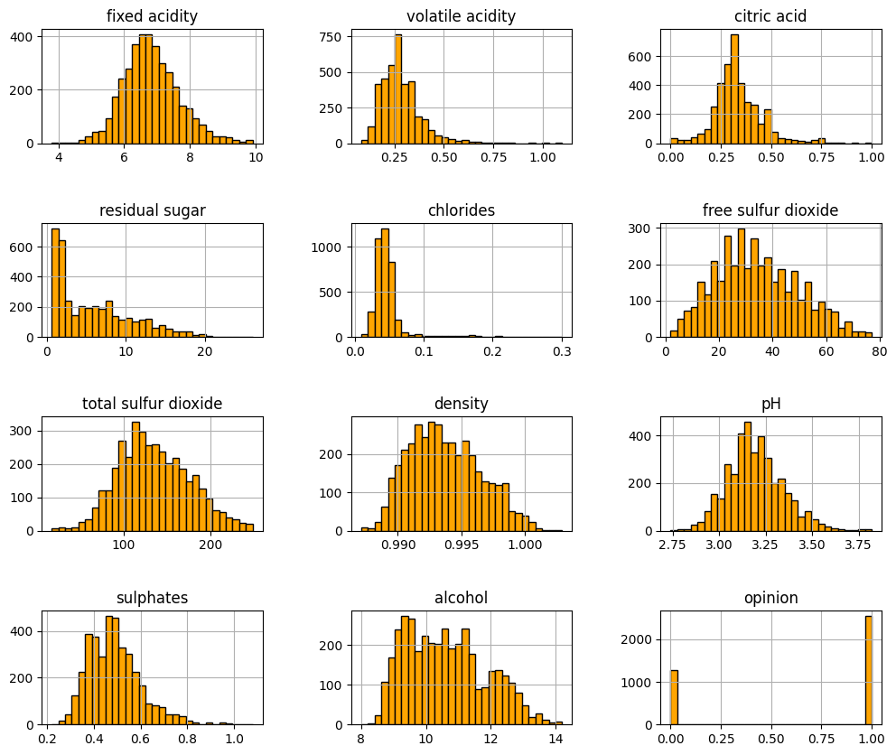

Veja como a variáveis se aproximaram ainda mais de uma normal.

***
#### Boxplots antes e depois do tratamento de dados

#### Antes

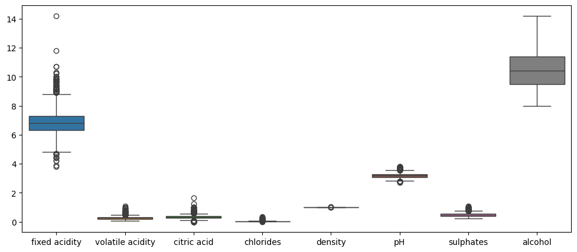

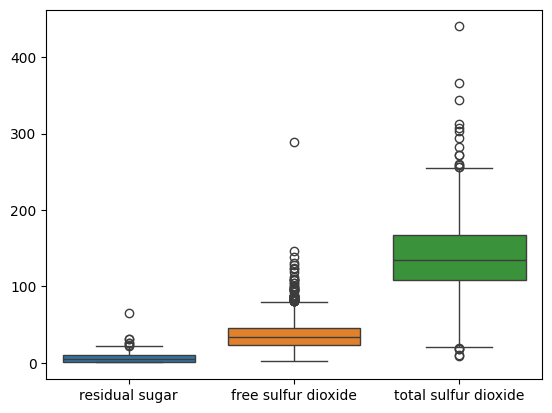

#### Depois

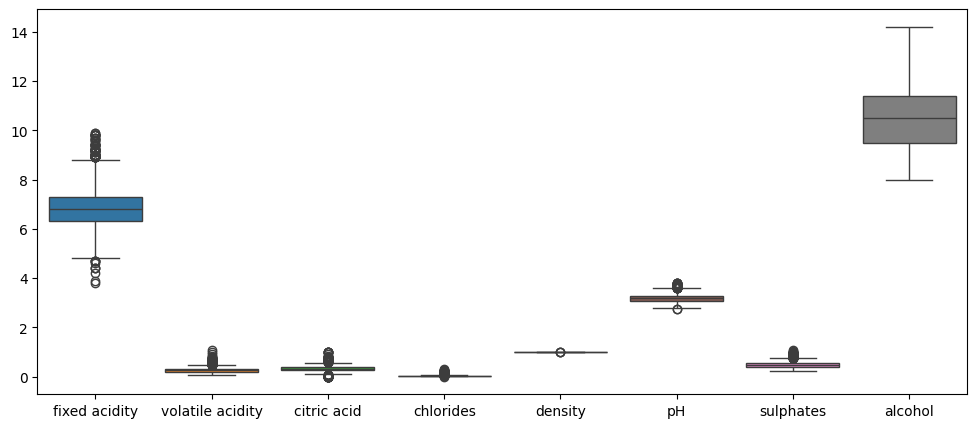

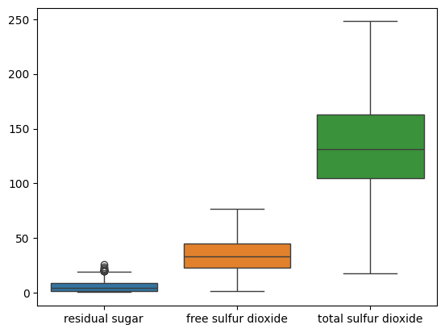

Apesar da ausência de alguns _outliers_ após o tratamento, é notável que ainda há valores fora dos limites superior e inferior para a maioria das variáveis. Entretanto, estes valores não foram considerados como discrepantes, pois mostrei através de fontes confiáveis (especialistas em vinhos) que estas variáveis poderiam assumir tais valores, já que estavam dentro da faixa permitida para composição do vinho.

***

#### **Teste de hipóteses:**

Aqui o teste foi feito entre cada variável e a variável categórica _'opinion'_.

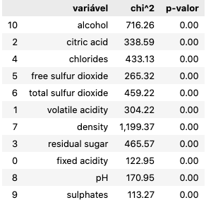

1) Hipótese nula - $H_0$ as duas variáveis são independentes;

2) Hipótese alternativa - $H_1$ as duas variáveis não são independentes.

O nível de significância ($\alpha$) é o limite superior para o $p$-valor, ou seja, se e somente se $p$-valor $<$ $\alpha$, então a hipótese nula pode ser rejeitada.

Para o nível de significância $\alpha=0.05$ e de acordo com os resultados na tabela acima, podemos rejeitar a hipótese nula $H_0$, seguindo assim com $H_1$, isto é, as duas variáveis não são independentes.

Com essa análise, podemos afirmar que há influência individual de cada variável na qualidade do vinho.

***


## Algoritmos de classificação utilizados: **Regressão Logística, Árvore de Decisão e Support Vector Machine (SVM)**
***

Será usado um modelo de validação cruzada estratificada com k-folds (k=10) para realizar a classificação e mostrarei qual fold apresenta o melhor resultado em relação à **```F1-Score```**, já que para este modelo é mais interessante ter a média harmônica entre a precisão e a recall. Segue os resultados para a base de treino e a média para a base de teste.
***
**REGRESSÃO LOGÍSTICA - BASE TREINO**

Fold 0 - Acurácia: 0.750; Precisão: 0.780; Recall: 0.870; F1-Score: 0.822

Fold 1 - Acurácia: 0.747; Precisão: 0.777; Recall: 0.869; F1-Score: 0.821

Fold 2 - Acurácia: 0.754; Precisão: 0.783; Recall: 0.873; F1-Score: 0.825

Fold 3 - Acurácia: 0.748; Precisão: 0.779; Recall: 0.865; F1-Score: 0.820

Fold 4 - Acurácia: 0.746; Precisão: 0.778; Recall: 0.865; F1-Score: 0.819

Fold 5 - Acurácia: 0.748; Precisão: 0.779; Recall: 0.868; F1-Score: 0.821

Fold 6 - Acurácia: 0.748; Precisão: 0.780; Recall: 0.866; F1-Score: 0.821

Fold 7 - Acurácia: 0.747; Precisão: 0.778; Recall: 0.866; F1-Score: 0.820

Fold 8 - Acurácia: 0.752; Precisão: 0.781; Recall: 0.872; F1-Score: 0.824

Fold 9 - Acurácia: 0.749; Precisão: 0.779; Recall: 0.870; F1-Score: 0.822

**MELHOR FOLD: 2**

***
**REGRESSÃO LOGÍSTICA - BASE DE TESTE  (MÉDIAS)**

Acurácia: 0.748

Precisão: 0.784

Recall: 0.857

F1-Score: 0.819
***


  **ÁRVORE DE DECISÃO - BASE DE TREINO**

Fold 0 - Acurácia: 0.757; Precisão: 0.807; Recall: 0.835; F1-Score: 0.821

Fold 1 - Acurácia: 0.756; Precisão: 0.802; Recall: 0.839; F1-Score: 0.820

Fold 2 - Acurácia: 0.760; Precisão: 0.805; Recall: 0.844; F1-Score: 0.824

Fold 3 - Acurácia: 0.753; Precisão: 0.802; Recall: 0.835; F1-Score: 0.818

Fold 4 - Acurácia: 0.757; Precisão: 0.805; Recall: 0.837; F1-Score: 0.821

Fold 5 - Acurácia: 0.757; Precisão: 0.804; Recall: 0.838; F1-Score: 0.821

Fold 6 - Acurácia: 0.757; Precisão: 0.806; Recall: 0.836; F1-Score: 0.821

Fold 7 - Acurácia: 0.755; Precisão: 0.803; Recall: 0.838; F1-Score: 0.820

Fold 8 - Acurácia: 0.756; Precisão: 0.804; Recall: 0.837; F1-Score: 0.820

Fold 9 - Acurácia: 0.753; Precisão: 0.803; Recall: 0.833; F1-Score: 0.818

**MELHOR FOLD: 2**
***
**ÁRVORE DE DECISÃO - BASE DE TESTE (MÉDIAS)**

Acurácia: 0.781

Precisão: 0.812

Recall: 0.872

F1-Score: 0.841
***

**SVM - BASE DE TREINO**

Fold 0 - Acurácia: 0.825; Precisão: 0.846; Recall: 0.900; F1-Score: 0.872

Fold 1 - Acurácia: 0.820; Precisão: 0.842; Recall: 0.898; F1-Score: 0.869

Fold 2 - Acurácia: 0.826; Precisão: 0.843; Recall: 0.906; F1-Score: 0.874

Fold 3 - Acurácia: 0.819; Precisão: 0.843; Recall: 0.895; F1-Score: 0.868

Fold 4 - Acurácia: 0.819; Precisão: 0.842; Recall: 0.896; F1-Score: 0.868

Fold 5 - Acurácia: 0.822; Precisão: 0.845; Recall: 0.898; F1-Score: 0.871

Fold 6 - Acurácia: 0.823; Precisão: 0.844; Recall: 0.900; F1-Score: 0.871

Fold 7 - Acurácia: 0.820; Precisão: 0.840; Recall: 0.901; F1-Score: 0.870

Fold 8 - Acurácia: 0.823; Precisão: 0.843; Recall: 0.901; F1-Score: 0.871

Fold 9 - Acurácia: 0.824; Precisão: 0.846; Recall: 0.899; F1-Score: 0.872

**MELHOR FOLD: 2**

***
**SVM - BASE DE TESTE (MÉDIAS)**

Acurácia: 0.797

Precisão: 0.816

Recall: 0.897

F1-Score: 0.854

***

## Curva ROC para cada modelo

A curva ROC mostra a probabilidade de um resultado verdadeiro positivo (sensibilidade) *versus* a probabilidade de um resultado falso positivo (1-especificidade) para diferentes pontos de corte. Portanto, quanto maiores os valores da sensibilidade e menores os valores da 1-especificidade, mais próximo a curva estará do modelo perfeito. Uma outra forma de ver isso é a partir do cálculo da área sob a curva. Pelo gráfico podemos ver que a área máxima é 1, ou seja, quanto maior a área abaixo da curva ROC, significa que ela está mais próxima de 1 e portanto melhor será o modelo.

#### Curva ROC para cada fold

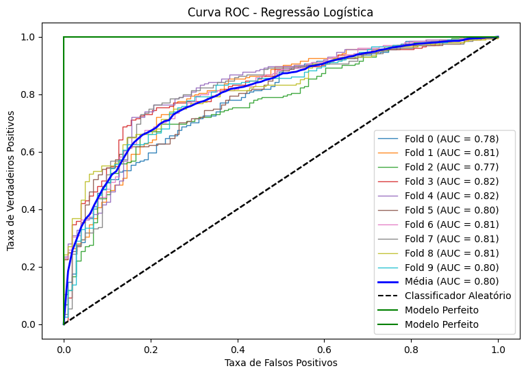
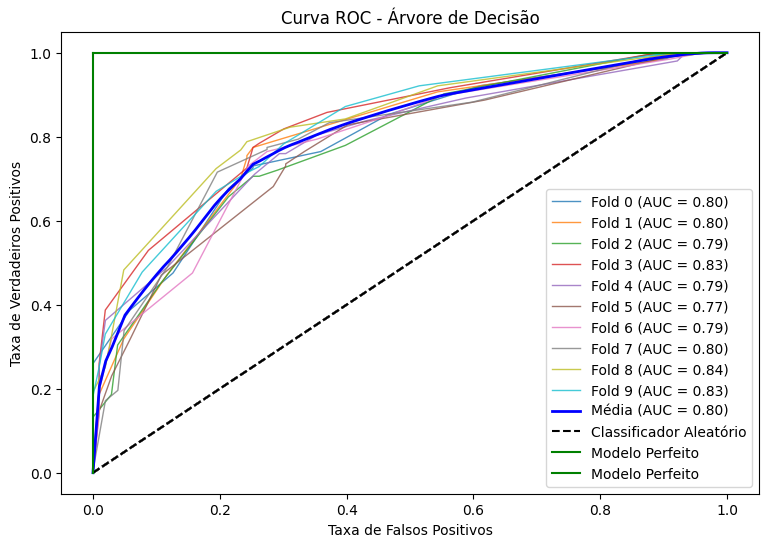
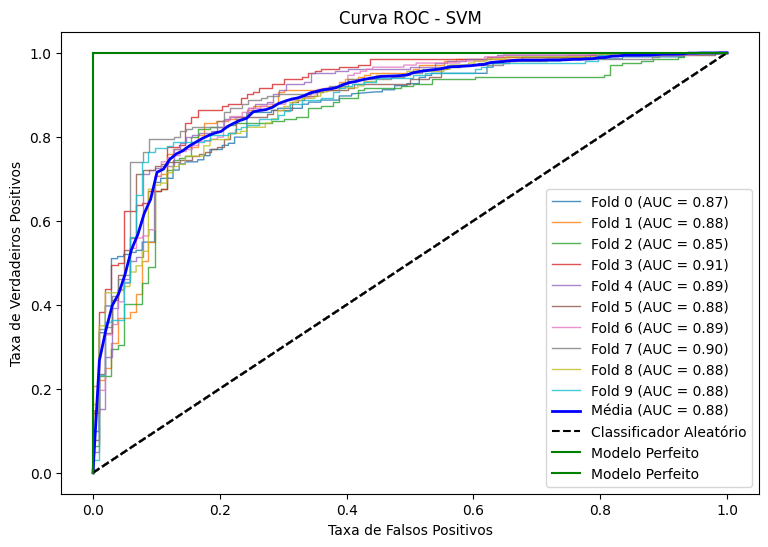

**```De acordo com os resultados mostrados, tanto para as métricas quanto para a curva ROC, o melhor modelo é o SVM.```**

***
**SVM aplicado diretamente na base de vinho tinto sem treinar o modelo para ver o quanto ele aprendeu**

**BASE DE TESTE**

Acurácia: 0.7133

Precisão: 0.8078

Recall: 0.6420

F1-Score: 0.6868

Os resultados mostram diferenças em torno de 9%, 1%, 26% e 18% para acurácia, precisão, recall e f1-score, respectivamente. As reduções já eram esperadas já que vinhos brancos possuem peculiaridades que não estão nos vinhos tintos - como este modelo foi treinado para vinhos brancos, então ele fica enviesado a tratar esse tipo de vinho. 


***

#### Sugestões de melhorias

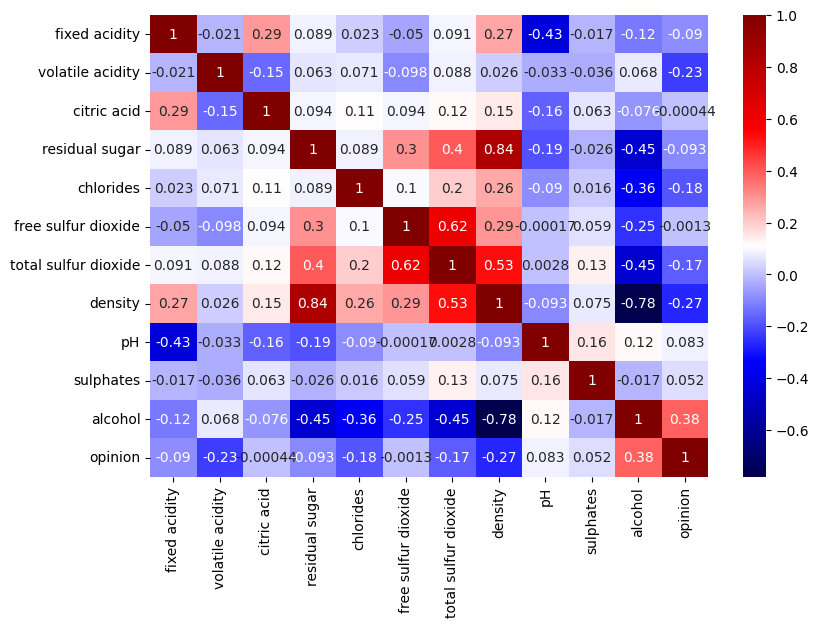

Alguns pontos podem ser explorados para melhorar ainda mais o desempenho do modelo. Observa-se que os pares de variáveis "density"/"residual sugar" e "density"/"alcohol" possuem correlação forte, sendo negativa o último par. Correlações fortes quando analisadas pela ótica da multicolinearidade podem trazer alguns problemas ao modelo. Há algumas formas de identificar a multicolinearidade, como por exemplo: valores altos do coeficiente de correlação; grandes alterações dos coeficientes de regressão - quando adicionamos ou removemos uma variável independente, ou quando há mudanças ou exclusões de observações no modelo; dentre outras. Uma das formas mais comuns para detectar a multicolinearidade é por meio do fator de inflação da variância (VIF). E como resolver este impasse? Alguns métodos são utilizados, como por exemplo: 
1) a remoção de uma ou mais variáveis independentes que estejam altamente correlacionadas e identificar outras variáveis independentes para ajudar na previsão. Obviamente procedimentos como este não devem ser feitos à revelia, pois podemos perder informações importantes contidas nas variáveis removidas; 
2) ACP (Análise de Componentes Principais); 
3) AF (Análise Fatorial); dentre outros.**

Outro ponto importante seria treinar a base total para que ele (o modelo) entenda as características diferentes de cada vinho e assim consiga suprimir ainda mais as diferenças apresentadas entre as métricas da base de treino e da base de teste.
***

